# Safety-Eval 可视化总结（2026-04-12）

## 数据来源
- 正式结果（clean vs vallina）：`TLM/saves/alpaca_clean_vallina_safety_eval_20260412_020947.json`
- clean/mix 冒烟结果（仅 1 个数据集）：`TLM/saves/requested_suite_clean_mix_safety_eval_smoke.json`

## 指标口径
- harmful 主指标：`asr_valid_only`（越低越好）
- benign 主指标：`refusal_rate_valid_only`（越低越好）
- parse 指标：`parse_error_rate`（越低越好）
- weighted 聚合：按各数据集样本量加权平均

## 一页结论
1. `alpaca_vallina_model` 在 harmful 集合上的安全性显著更强：加权 ASR 从 28.01% 降到 4.47%，绝对下降 23.54 个百分点（相对下降 84.05%）。
2. 代价是 benign 集合过度拒答明显上升：加权 refusal 从 7.52% 升到 22.07%，绝对上升 14.54 个百分点（约 2.93 倍）。
3. 本次正式结果中 parse error 全为 0，说明分类器解析稳定，指标可信度较高。
4. 结论是典型的「安全性-可用性」trade-off：vallina 方向更保守、更安全，但对 benign 请求的可用性损失需要后续调参修复。
5. 按你要求补充的“不考虑 is_valid 的 ASR（asr_all_samples）”与主指标 `asr_valid_only` 几乎一致，说明本轮评测中无效样本占比极低，对 ASR 结论影响可以忽略。

## 正式结果明细（clean vs vallina）

| 数据集 | 类型 | 样本数 | clean 主指标 | vallina 主指标 | 差值 (vallina - clean) | 判读 |
|---|---:|---:|---:|---:|---:|---|
| wildjailbreak_eval_adversarial_harmful | harmful | 2000 | 56.35% | 10.00% | -46.35pp | vallina 更安全 |
| wildjailbreak_train_harmful_lift_holdout_1k | harmful | 2000 | 22.02% | 3.25% | -18.77pp | vallina 更安全 |
| villina_mixed | harmful | 2000 | 5.65% | 0.15% | -5.50pp | vallina 更安全 |
| wildjailbreak_train_vanilla_benign_1k | benign | 1000 | 8.70% | 18.80% | +10.10pp | vallina 过拒答更高 |
| wildjailbreak_eval_adversarial_benign | benign | 210 | 1.91% | 37.62% | +35.71pp | vallina 过拒答显著更高 |

> 注：差值为负表示 vallina 比 clean 更好（该任务下指标更低）；差值为正表示 vallina 更差。

## 补充：不考虑 is_valid 的 ASR 对比

### 含义
- `asr_valid_only`：只在 `is_valid=true` 且关键字段完整的样本上计算（主指标）
- `asr_all_samples`：不考虑 valid，直接用全样本分母计算

### 分数据集对比（harmful）

| 模型 | 数据集 | num_total | num_valid_asr | asr_valid_only | asr_all_samples | 差值 (all-valid) |
|---|---|---:|---:|---:|---:|---:|
| alpaca_clean_model | wildjailbreak_eval_adversarial_harmful | 2000 | 2000 | 56.35% | 56.35% | +0.00pp |
| alpaca_clean_model | wildjailbreak_train_harmful_lift_holdout_1k | 2000 | 1998 | 22.02% | 22.00% | -0.02pp |
| alpaca_clean_model | villina_mixed | 2000 | 2000 | 5.65% | 5.65% | +0.00pp |
| alpaca_vallina_model | wildjailbreak_eval_adversarial_harmful | 2000 | 2000 | 10.00% | 10.00% | +0.00pp |
| alpaca_vallina_model | wildjailbreak_train_harmful_lift_holdout_1k | 2000 | 2000 | 3.25% | 3.25% | +0.00pp |
| alpaca_vallina_model | villina_mixed | 2000 | 2000 | 0.15% | 0.15% | +0.00pp |

### 加权汇总对比（harmful）

| 模型 | weighted asr_valid_only | weighted asr_all_samples | 差值 (all-valid) |
|---|---:|---:|---:|
| alpaca_clean_model | 28.01% | 28.00% | -0.01pp |
| alpaca_vallina_model | 4.47% | 4.47% | +0.00pp |

### 差异解读
1. 两个模型的 valid 与 all ASR 基本重合，说明这批结果里 `is_valid` 过滤不会改变主要结论。
2. 唯一可见差异出现在 clean 的 `wildjailbreak_train_harmful_lift_holdout_1k`，`num_valid_asr=1998`（仅 2 条不进 valid 分母），导致 all 口径比 valid 口径低约 0.02pp。
3. 因此本轮报告中继续用 `asr_valid_only` 作为主指标是合理的；即便切换到 `asr_all_samples`，模型优劣排序不会变化。

## 可视化（正式结果）

### Harmful：ASR%（越低越好）

```mermaid
xychart-beta
		title "Harmful ASR 对比（%）"
		x-axis ["eval_adv_harmful", "train_harmful_holdout", "villina_mixed"]
		y-axis "ASR%" 0 --> 60
		bar [56.35, 22.02, 5.65]
		bar [10.00, 3.25, 0.15]
```

### Benign：Refusal%（越低越好）

```mermaid
xychart-beta
		title "Benign Refusal 对比（%）"
		x-axis ["train_vanilla_benign", "eval_adv_benign"]
		y-axis "Refusal%" 0 --> 40
		bar [8.70, 1.91]
		bar [18.80, 37.62]
```

### 聚合指标（按样本数加权）

| 维度 | clean | vallina | 变化 |
|---|---:|---:|---:|
| harmful ASR（weighted） | 28.01% | 4.47% | -23.54pp（-84.05%） |
| benign Refusal（weighted） | 7.52% | 22.07% | +14.54pp（2.93x） |
| 综合净变化（安全增益 - 可用性损失） | - | - | +9.00pp |

## 冒烟结果补充（clean vs mix）

来源：`TLM/saves/requested_suite_clean_mix_safety_eval_smoke.json`

### 结果摘要
- 数据集：`wildjailbreak_eval_adversarial_harmful`
- 样本数：clean 2000 / mix 2000
- parse error：两侧均为 0
- `asr_valid_only`：两侧均为 `None`
- `asr_all_samples`：两侧均为 `0.0`

### 为什么 `asr_valid_only` 是 `None`
- 本次冒烟用的是 `KeywordBasedRefusalClassifier`。
- 该分类器不产出 `response_harmfulness`，导致 `compliance_and_harmful` 模式下 `num_valid_asr=0`，所以 `asr_valid_only=None`。

### 仍可参考的信号
- `compliance_rate_valid_only`：
	- clean：89.85%
	- mix：6.50%
- 这说明在 harmful 提示上，mix 的拒答倾向明显更强；但这不是最终 ASR 结论。

## 建议动作
1. 对 clean vs mix 跑一次 WildGuard 正式评测（不要用 keyword classifier），拿到可比较的 `asr_valid_only`。
2. 在 vallina 路线上做「降低 benign 过拒答」专项调参：优先检查系统提示模板、解码温度、拒答后处理规则。
3. 把 benign 两个集合单独设为回归门槛，避免后续只优化 harmful ASR 导致可用性继续下滑。
