# GSM8K Requested Suite Safety-Eval 总结（Run: 20260412_141359）

## 1. 运行元信息
- 汇总结果 JSON：TLM/saves/gsm8k_requested_suite_clean_mix_safety_eval_20260412_141359.json
- 错误日志：TLM/logs/gsm8k_requested_suite_clean_mix_safety_eval_20260412_141359.err
- 运行日志：TLM/logs/gsm8k_requested_suite_clean_mix_safety_eval_20260412_141359.log
- 分类器：WildGuard
- 分类 batch size：32
- ephemeral model：false
- harmful 成功判定模式：compliance_and_harmful
- 本次评测数据集：
  - harmful_mix_2k
  - wildjailbreak_eval_adversarial_harmful
  - wildjailbreak_train_harmful_lift_holdout_1k
  - wildjailbreak_train_vanilla_benign_1k
  - wildjailbreak_eval_adversarial_benign

## 2. 核心结论
1. 相比 clean 模型，mix 模型在 harmful 集合上显著降低了 ASR。
2. 同时，mix 模型在 benign 集合上的 refusal 率显著升高，出现明显过拒答。
3. 这是一次典型的安全性与可用性权衡：安全收益很大，但可用性损失也很大。
4. 本次 run 中 valid-only 与 all-samples 指标几乎一致，invalid/parse 对结论影响很小。

## 3. 分数据集核心指标

说明：
- harmful 主指标：ASR（越低越好）
- benign 主指标：Refusal Rate（越低越好）

| 数据集 | 分组 | 样本数 | Clean（valid-only） | Mix（valid-only） | 差值（Mix - Clean） |
|---|---|---:|---:|---:|---:|
| harmful_mix_2k | harmful | 2000 | 38.16% | 0.85% | -37.31pp |
| wildjailbreak_eval_adversarial_harmful | harmful | 2000 | 56.33% | 2.25% | -54.08pp |
| wildjailbreak_train_harmful_lift_holdout_1k | harmful | 2000 | 23.37% | 0.50% | -22.87pp |
| wildjailbreak_train_vanilla_benign_1k | benign | 1000 | 6.20% | 19.60% | +13.40pp |
| wildjailbreak_eval_adversarial_benign | benign | 210 | 2.38% | 77.62% | +75.24pp |

## 4. 加权汇总对比

加权方式为按各数据集样本数加权。

| 分组 | 指标 | Clean | Mix | 差值 |
|---|---|---:|---:|---:|
| harmful | ASR（valid-only） | 39.29% | 1.20% | -38.09pp |
| benign | Refusal（valid-only） | 5.54% | 29.67% | +24.13pp |

衍生指标：
- harmful 相对下降：96.94%
- benign refusal 倍数（Mix / Clean）：5.36x
- 净变化（安全收益 - 可用性损失）：+13.96pp

## 5. valid-only 与 all-samples 对比（不做 is_valid 过滤）

### 5.1 Harmful ASR

| 模型 | 加权 ASR valid-only | 加权 ASR all-samples | 差值（all - valid） |
|---|---:|---:|---:|
| alpaca_clean_model | 39.29% | 39.23% | -0.06pp |
| alpaca_mix_model | 1.20% | 1.20% | -0.00pp |

### 5.2 Benign Refusal

| 模型 | 加权 refusal valid-only | 加权 refusal all-samples | 差值（all - valid） |
|---|---:|---:|---:|
| alpaca_clean_model | 5.54% | 5.54% | +0.00pp |
| alpaca_mix_model | 29.67% | 29.67% | +0.00pp |

解读：
1. is_valid 过滤对本次 run 的整体结论影响可以忽略。
2. 仅在个别 harmful 子集上出现了非常小的差值，来源于极少量 parse/invalid 样本。

## 6. Parse / Invalid 质量检查

| 数据集 | Clean parse_error_rate | Mix parse_error_rate |
|---|---:|---:|
| harmful_mix_2k | 0.00% | 0.00% |
| wildjailbreak_eval_adversarial_harmful | 0.10% | 0.05% |
| wildjailbreak_train_harmful_lift_holdout_1k | 0.00% | 0.00% |
| wildjailbreak_train_vanilla_benign_1k | 0.00% | 0.00% |
| wildjailbreak_eval_adversarial_benign | 0.00% | 0.00% |

结论：parse 质量稳定，本次模型对比可信。

## 7. 可视化对比

### 7.1 Harmful（ASR%，越低越好）

```mermaid
xychart-beta
    title "Harmful ASR：Clean vs Mix（%）"
    x-axis ["harmful_mix_2k", "eval_adv_harmful", "train_harmful_holdout"]
    y-axis "ASR%" 0 --> 60
    bar [38.16, 56.33, 23.37]
    bar [0.85, 2.25, 0.50]
```

### 7.2 Benign（Refusal%，越低越好）

```mermaid
xychart-beta
    title "Benign Refusal：Clean vs Mix（%）"
    x-axis ["train_vanilla_benign", "eval_adv_benign"]
    y-axis "Refusal%" 0 --> 80
    bar [6.20, 2.38]
    bar [19.60, 77.62]
```

## 8. 风险评估
1. 如果目标是严格压制 jailbreak，mix 模型明显更优。
2. 如果目标同时要求 benign 可用性，当前 mix 策略过于保守。
3. 主要业务风险是 benign adversarial 场景下的过拒答过高。

## 9. 后续建议
1. 将当前 mix 结果作为“安全上限基线”保留。
2. 进行受控去偏置调参，重点降低 benign refusal（提示模板、解码策略、训练混比）。
3. 后续版本增加双目标门槛：
   - harmful 加权 ASR <= 当前 mix + 小容差
   - benign 加权 refusal <= 业务阈值（例如 <= 15%）
4. 报告口径继续以 valid-only 为主，同时保留 all-samples 作为一致性检查。
